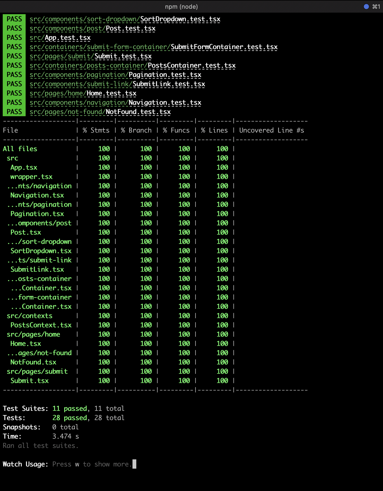
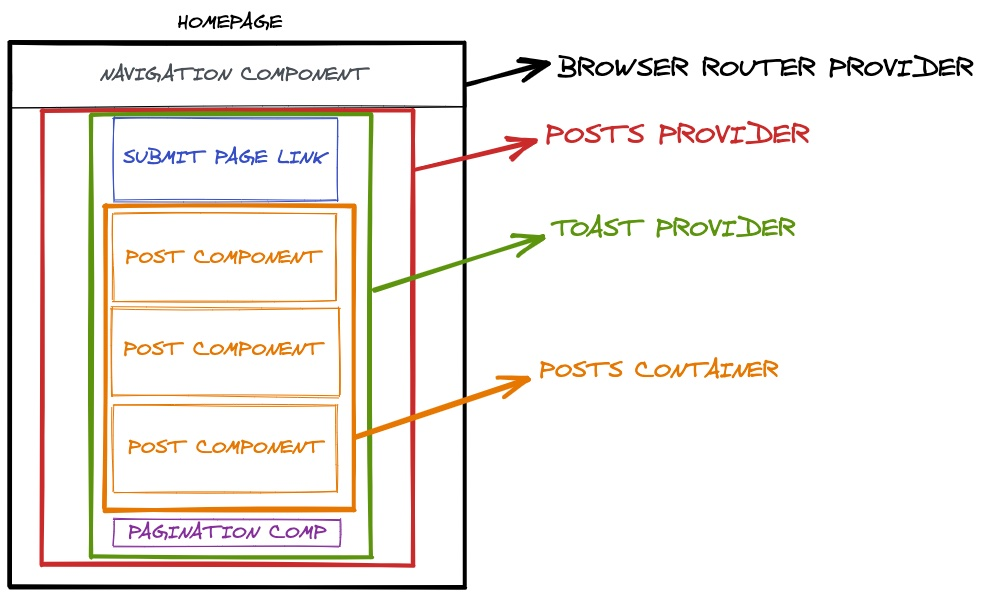
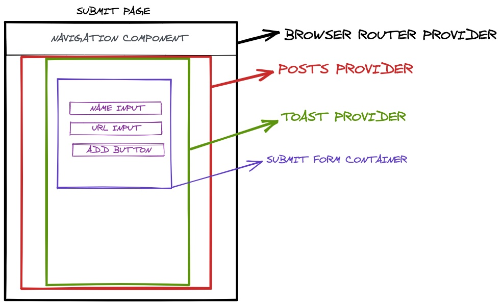

# Case

This project was bootstrapped with [Create React App](https://github.com/facebook/create-react-app).

Added features below into CRA:

- [x] Typescript
- [x] Bootstrap
- [x] React Router
- [x] GitHub Actions { Install, Run unit tests, Build, Deploy }



# Home page



# Submit page



# Demo: GitHub Pages

```
https://case.esma.dev/
```

# Start locally

```bash
git clone git@github.com:esmaydogdu/redditish.git esma-case;
cd esma-case;
npm install;
npm start;
```


# Data format

```javascript
// Posts context holds the data as below.
const posts = [
  { timestamp: 1, name: "reddit", url: "https://reddit.com", vote: 2 },
  { timestamp: 2, name: "google", url: "https://google.com", vote: 1 },
  { timestamp: 3, name: "twitter", url: "https://twitter.com", vote: 2 },
  { timestamp: 4, name: "facebook", url: "https://facebook.com", vote: -5 },
];
```

```javascript
// Sorting strategy.
// Sorting by vote
// If the votes are equal, latest post will be first.

// Descending
posts.sort((a, b) => b.vote - a.vote || b.timestamp - a.timestamp);

// Ascending
posts.sort((a, b) => a.vote - b.vote || b.timestamp - a.timestamp);

// Adding new post.
posts.push({timestamp: Date.now(), name: "testname", url: "https://github.com", vote: 0})

// Removing selected post by timestamp.
posts.filter(post => post.timestamp !== 1622050400326)

// Pagination algorithm.
let page = 1;
let perPage = 2;
posts.slice(page * perPage - perPage, page * perPage)
[ 
  { timestamp: 1, name: "reddit", url: "https://reddit.com", vote: 2 },
  { timestamp: 2, name: "google", url: "https://google.com", vote: 1 }
]
```
